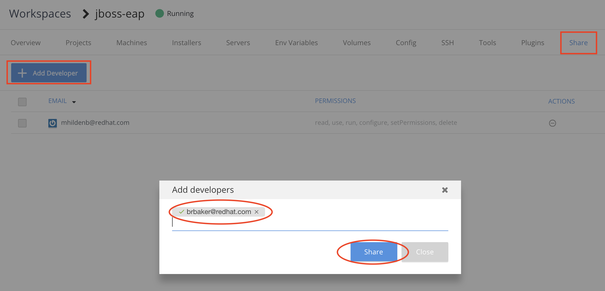
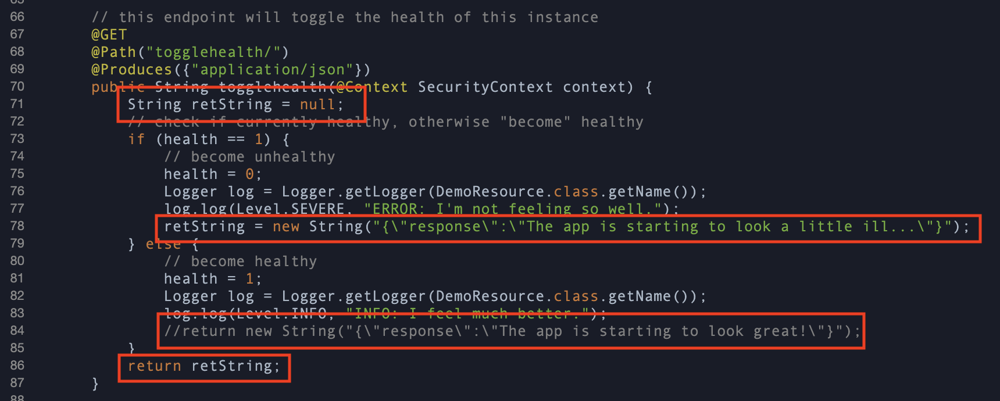
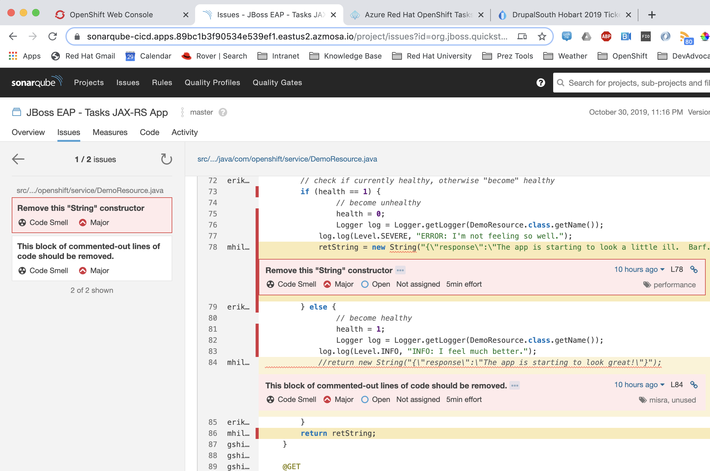

= Installing and Using CodeReady Workspaces on ARO 3.11

.Demo Resources
****
This was originally based on the CICD demo in ARO referenced link:http://aroworkshop.io/[here].

It is assumed that you have first provisioned a 3.11 cluster in Azure that you have admin (not cluster-admin) rights to.  This demo should be deployable to managed environments.
****

== Setting the Scene

This demo builds upon an existing Azure RedHat Openshift demo which can be found at link:http://aroworkshop.io/[http://aroworkshop.io/].

For the conceit of this demo, we will pretend that the "Tasks" application from the Azure RedHat Openshift demo is an application that BigBusiness.com.  

INFO: The application is actually a JBoss EAP app (more info can be found link:https://github.com/OpenShiftDemos/openshift-tasks["here"]) that highlights aspects of OpenShift's functionality.  

Red Hat has setup the following infrastructure for BigBusiness.com on (dedicated) Azure Red Hat Openshift (ARO) infrastructure:

In this demo, we have 3 different projects:

* Tasks - Dev: This is meant to represent our Dev environment for Tasks
* Tasks - Stage: This is meant to represent our 
* CI/CD: This project contains our devops including
** A sample OpenShift Pipeline, a pre-defined CI/CD pipeline on ARO.
** Jenkins, open source CI/CD engine and automation server.
** Nexus, software artifact repository.
** SonarQube, a static analysis platform
** Gogs, a self-hosted GitHub service (with attendant database)

== The Value Proposition

BigBusiness would like to have its Tasks application developed by remote teams and temporary staff.  Tasks is a proprietary app and as such the source code needs to be protected.  Thus, BigBusiness.com has the following drivers for their remote teams and temporary staff:

* They must get up to speed quickly and be productive and not spend ages setting up their environments
* They must *not* be able to access the source code directory or clone it to their laptops

This makes CodeReady Workspaces a very appealing option for BigBusiness.com

== What you will see

In this demo, you will see

* How to install RedHat's official CodeReady Workspace distribution on an ARO cluster _without cluster-admin rights_
* How one user can setup a CodeReady Workspace and invite others for use
* See how a second dev and edit code and the first dev can see it
* See a commit to the internal git repository trigger a model continuous integration pipeline
* Test deployed changes in Dev and notice a bug
* Use CodeReady workspaces to find the bug
* Post Mortem: Look at the results of the static analysis in the CI/CD that might have found the bug
* Promote to staging

== Setup

1. Open a shell and enter the following to get the demo
----
git clone -b ocp-3.11 https://github.com/hatmarch/codeready-java.git
cd codeready-java
export DEMO_HOME=$(pwd)
----

There is a .devcontainer with all the necessary tools setup on it if you'd prefer to run that.  If so, do this:

----
cd $DEMO_HOME
code .
----

Then, open Code in container.  Once the folder has been mounted in a container, then open a bash terminal and run the following:

----
export DEMO_HOME=$(pwd)
----

[blue]#Finally: Don't forget to log into the proper openshift cluster in whichever terminal you choose#

=== Installing CodeReady Workspace

WARNING: You can only install a very specific version of the CodeReady Workspace on OpenShift Dedicated (or ARO).  We link to that below.

1. Download the 1.0.2.GA CodeReady operator installer from link:https://access.redhat.com/documentation/en-us/red_hat_codeready_workspaces/1.2/html/administration_guide/installing-codeready-workspaces-on-openshift-dedicated[access.redhat.com]
** If you go directly to access.redhat.com, you will need to search for "Installing CodeReady Workspaces on OpenShift Dedicated"
** Follow the links to download
2. _Optional:_ Change storage to be per-workspace
3. Go to the download directory with a shell that is logged into your cluster
----
$DEMO_HOME/install/codeready-workspaces-operator-installer/deploy.sh --deploy -p=demo-workspaces \
    --operator-image=registry.redhat.io/codeready-workspaces/server-operator:1.0 \
    --server-image=registry.redhat.io/codeready-workspaces/server-rhel8:1.2
----
NOTE: This installs an *Operator* which in turn installs all the required components for CRW.  It will take a few minutes to setup.  At this point, you could switch to a CRW you prepared earlier

4. Check the progress of the operator with this command [red]#_Not available on OpenShift 3_#
----
watch 'oc get csv -ocustom-columns-file=$DEMO_HOME/install/csv-columns.txt -n demo-workspaces'
----

4. Check to see if the workspace is done with the following command
----
oc get pods -n demo-workspaces -w
----

5. Once all the pods are running you are ready to proceed

=== Installing "Tasks" Demo Application

1. Whilst you're waiting for the workspace to be installed, open a shell and enter the following to deploy the "Tasks" demo app and it's attendant cicd, dev, and staging environment projects.
----
$DEMO_HOME/scripts/provision.sh deploy --project-suffix crw --ephemeral
----

2. Check to see that all pods are running
----
NAME                        READY   STATUS    RESTARTS   AGE
cicd-demo-installer-t6zcn   1/1     Running   0          2m
gogs-1-h5ct5                1/1     Running   2          1m
gogs-postgresql-1-9bcmh     1/1     Running   0          1m
jenkins-2-m8mm8             1/1     Running   0          2m
nexus-1-deploy              1/1     Running   0          1m
nexus-1-gg88g               1/1     Running   0          1m
sonardb-1-5fvpj             1/1     Running   0          1m
sonarqube-1-dfcv8           1/1     Running   0          1m
----

[NOTE]
.What to do if pods are missing...
====
If some pods are missing or in an error state, the deployment failed for some reason (usually due to timeouts pulling the DB images for gogs and sonarqube).  Run the following command to delete resources and then go back to the start of <<Installing "Tasks" Demo Application,this section>> and try again.
----
$DEMO_HOME/scripts/provision.sh delete --project-suffix crw --ephemeral
----
====
=== Create a Workspace Instance for Tasks

NOTE: You must have finished installing CodeReady workspaces on the cluster as per <<Installing CodeReady Workspace,here>>

1. Navigate to the demo-workspaces project.  Then click on network routes.  Click on the exposed route for the CRW.  Alternatively, run this command to get the route and paste it into your browser:
----
oc get route codeready -n demo-workspaces --no-headers | awk '{print $2}'
----

2. You will be prompted to log in.  Instead, hit the registration button.
3. Create a new JBoss workspace and wait for that to complete
[red]#** Workspaces can take a long time to load for the first time, perhaps as much as 10 minutes or more#

[NOTE]
.Sometimes workspaces fail to load
====
* Many times workspaces will fail to startup due to timeout issues around persistent volumes.  Generally the way around this is to just try again.  You can diagnose by watching the events of the pods that are created in the demo-workspaces environment.

* If the JBoss workspace fails to load, try the java only workspace

* If the loading screen gets stuck, but there is a green dot next to the workspace, then click away from the workspace and back onto it to restart client load
====

== Import Tasks Code into Workspace

1. Once the workspace is loaded, we're going to need to import a project, from our self-hosted git repo
2. Get the route to the gogs repo
----
$ oc get route -n cicd-crw gogs
----
2. In a separate tab, open that route to go to the gogs workspace
* Point out the service route of the gogs workspace
* replace the clone http route with the service name of the route
3. Log into Gogs
* user: gogs
* pass: gogs
4. You could use the public route for gogs, but for the sake of the security of the repo, you can show how the CodeReady workspace has access to the repo in the cluster (following steps)

3. Open the new workspace
4. Click on Import Project and fill it in with the result of this command
----
$ echo "http://$(oc get svc gogs -o template --template='{{.spec.clusterIP}}'):3000/gogs/openshift-tasks.git"
----

image::../images/import-project.png[]

5. Configure as Maven

== Share workspace

1. Open an incognito window or another browser, and move this window to a place where it can be seen with other CRW window.
** this window will be referred to as the window *CRW-2*

2. *CRW-2*: Go to the CodeReady Workspace route as gotten by this command and be sure to select the *eap-7* branch:
----
echo "$(oc get route codeready -n demo-workspaces)"
----

2. *CRW-2*: At the login page click "Register" to create a new user 

3. *CRW-2*: Enter new user details, paying special attention to the user name or email and click "Register" button

3. *CRW-2*:Click the "Workspaces" link on the left.  You will be sent to an empty workspace page.  Wait there 

6. *CRW*: Follow the image to go to the Workspace view and then select the gear to configure

image::../images/configure-workspace.png[]

3. *CRW*: Click on Share tab, then Add Developer, and then enter the email of the user created in previous step and press enter key.  Then click "Share"
** if the address entered matches a registered user, the email will be put in a box

5. *CRW-2*: Back in the incognito window, the shared workspace should appear in the dashboard.  Open that workspace
** NOTE: You may need to hit refresh to make the workspace appear

5. *CRW-2*: When the workspace opens, navigate to the *DemoResource.java* file so that changes can be watched.

== Edit the code

1. *CRW-1*: Open *index.jsp*.  Open the file by navigating to it (from assistant menu)

image::../images/navigate-to.png[]

2. Find and Replace "OpenShift Tasks" with "Azure Red Hat Openshift Tasks"
3. Navigate to: *DemoResource.java* and search (CMD-F) for the "toggleHealth" method and wait there

4. *CRW-2*: Whilst the original CRW workspace can still be seen, make the following changes to the *toggleHealth* method:

====

====

5. Notice that changes being made in CRW-2 are showing up in CRW-1

== Compile the code

1. *CRW-2*: Build the project by using the maven build command (from UI)

== Commit the code

3. *CRW-1*: Switch to the OpenShift console tab and go to the *CI/CD* project in OpenShift.
** Select the Build > Pipelines option on the right in Window #2
====

====

1. *CRW-2*: Open Git window by going to Git > Commit

image::../images/git-commit.png[]

2. *CRW-2*: Make sure the changes are selected, enter a commit message, and click commit (being sure the push committed changes to: is _not_ checked)

4. *CRW-2*: In this window open the terminal, navigate to the project directory, and push to origin.  Enter username and password as
** user: gogs
** pass: gogs
----
$ cd openshift-tasks
$ git push origin

Enumerating objects: 17, done.
Counting objects: 100% (17/17), done.
Delta compression using up to 4 threads.
Compressing objects: 100% (7/7), done.
Writing objects: 100% (9/9), 754 bytes | 754.00 KiB/s, done.
Total 9 (delta 2), reused 0 (delta 0)
Username for 'http://gogs.cicd-crw.svc.cluster.local:3000': gogs
Password for 'http://gogs@gogs.cicd-crw.svc.cluster.local:3000':
To http://gogs.cicd-crw.svc.cluster.local:3000/gogs/openshift-tasks.git
   3c27c77..0150cfc  eap-7 -> eap-7
----

5. Watch the build and wait for the dev stage to finish

5. Get the Tasks - Dev route.
----
oc get route tasks -n dev-crw --no-headers | awk '{ print $2 }' 
----

5. *CRW-2*: In incognito window, Navigate to the Tasks - Dev route found in the previous step.  Play with the app
* Notice the issue where you don't get a message when toggling back to healthy

== Debugging the container

There is clearly an issue that we're not getting a message whenver we toggle health.  We need to debug this issue.

WARNING: You need to ensure the DeploymentConfig for the Tasks pod has JAVA_OPTS that include the debugger flags.  This should have been setup in the deployment

1. *CRW-1*: Navigate to *DemoResource.java* and set a breakpoint on line 71 by clicking on the number

2. Find the IP address of the dev pod by using this command:
----
oc get pod $(oc get pods -n dev-crw | grep -i running | awk '{ print $1}') -o template --template='{{.status.podIP}}' -n dev-crw
----

2. In the console tab of this window, look up the IP address of one of the running containers
* Open the "Tasks - Dev" project
* Go to Application > Pods
* Select the running tasks pod and look at the details.  Find the IP address of the pod

image::../images/task-dev-ip.png[]

3. Go to the CodeReady Workspace and select Run > Edit Debug Configuration
4. Using IP address, update the Debug Configuration per this image:

image::../images/remote-debug-configuration.png[]

5. Click Save, then click Debug
* Notice the Debug "perspective" in the workspace window

6. *CRW-2*: In window with app running, click on Toggle Health
* You should show up in the debugger in Window #1 (*CRW-1*)

7. *CRW-1*: Demonstrate stepping functionality, watch window, and stack trace.

8. Close debugging, navigate to Pipelines for dev-crw project again.

8. *CRW-2*: Fix the code and recommit and deploy from the command line
----
$ cd openshift-tasks/
$ git add .
$ git commit -m "Fix toggleHealth"
$ git push origin
----

== Promote to Staging

1. Make sure Window #2 is set to Build > Pipelines on the commit from last section
2. Wait until "Promote to STAGE?" lights up so you can click it
* NOTE: If you miss it, just click the *Start Pipeline* button in the corner

image::../images/promote-to-stage.png[]

3. *CRW-2*: Show the _staging_ build running properly using the url of this command
----
oc get route tasks -n stage-crw --no-headers | awk '{ print $2 }' 
----

== Post Mortem

1. Static Analysis Warned us!

