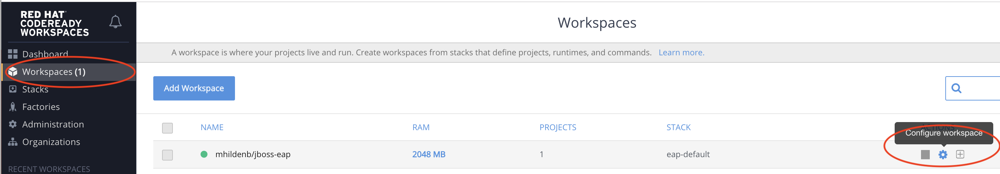
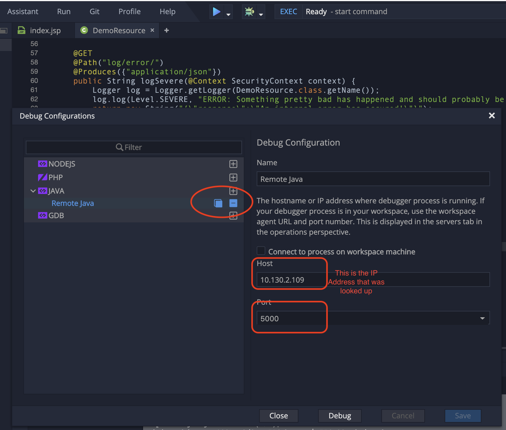

= Installing and Using CodeReady Workspaces on ARO 3.11

.Demo Resources
****
This was originally based on the CICD demo in ARO referenced link:http://aroworkshop.io/[here].

The main thing you're going to want to run to setup things is:
----
./cicd/scripts/provision.sh deploy --project-suffix crw
----
****

== Setting the Scene

This demo builds upon an existing Azure RedHat Openshift demo which can be found at link:http://aroworkshop.io/[http://aroworkshop.io/].

For the conceit of this demo, we will pretend that the "Tasks" application from the Azure RedHat Openshift demo is an application that BigBusiness.com.  

INFO: The application is actually a JBoss EAP app (more info can be found link:https://github.com/OpenShiftDemos/openshift-tasks["here"]) that highlights aspects of OpenShift's functionality.  

Red Hat has setup the following infrastructure for BigBusiness.com on (dedicated) Azure Red Hat Openshift (ARO) infrastructure:

image::../images/aro-pipeline.png[]

In this demo, we have 3 different projects:

* Tasks - Dev: This is meant to represent our Dev environment for Tasks
* Tasks - Stage: This is meant to represent our 
* CI/CD: This project contains our devops including
** A sample OpenShift Pipeline, a pre-defined CI/CD pipeline on ARO.
** Jenkins, open source CI/CD engine and automation server.
** Nexus, software artifact repository.
** SonarQube, a static analysis platform
** Gogs, a self-hosted GitHub service (with attendant database)

== The Value Proposition

BigBusiness would like to have its Tasks application developed by remote teams and temporary staff.  Tasks is a proprietary app and as such the source code needs to be protected.  Thus, BigBusiness.com has the following drivers for their remote teams and temporary staff:

* They must get up to speed quickly and be productive and not spend ages setting up their environments
* They must *not* be able to access the source code directory or clone it to their laptops

This makes CodeReady Workspaces a very appealing option for BigBusiness.com

== What you will see

In this demo, you will see

* How to install RedHat's official CodeReady Workspace distribution on an ARO cluster _without cluster-admin rights_
* How one user can setup a CodeReady Workspace and invite others for use
* See how a second dev and edit code and the first dev can see it
* See a commit to the internal git repository trigger a model continuous integration pipeline
* Test deployed changes in Dev and notice a bug
* Use CodeReady workspaces to find the bug
* Post Mortem: Look at the results of the static analysis in the CI/CD that might have found the bug
* Promote to staging

== Installing CodeReady Workspace

1. Download the CodeReady Workspace installer from link:https://access.redhat.com/documentation/en-us/red_hat_codeready_workspaces/1.1/html/administration_guide/installing_codeready-workspaces[access.redhat.com]
2. _Optional:_ Change storage to be per-workspace
3. Run the deploy script to install CRW in demo-workspaces
----
./deploy.sh —deploy -p=demo-workspaces \
    --operator-image=registry.redhat.io/codeready-workspaces/server-operator:1.0 \
    --server-image=registry.redhat.io/codeready-workspaces/server-rhel8:1.2
----
NOTE: This installs an *Operator* which in turn installs all the required components for CRW.  It will take a few minutes to setup.  At this point, you could switch to a CRW you prepared earlier

4. Open the overview for the demo-workspaces project.  Click on the exposed route for the CRW
5. You will be prompted to log in.  Enter Marc's login details
NOTE: This is part of the keycloak implementation that allows accounts to restrict access to the CRW
6. Bryon will also register with email address brbaker@redhat.com in a separate browser

== Setup a workspace for Tasks

1. Create a new JBoss workspace
2. In a separate tab, open the route to the gogs workspace
* Point out the service route of the gogs workspace
* replace the clone http route with the service name of the route
----
http://gogs.cicd.svc.cluster.local:3000/gogs/openshift-tasks.git
----
3. Open the new workspace
4. Click on Import Project

image::../images/import-project.png[]

5. Configure as Maven

image::../images/project-configuration.png[]

6. Go to Configure workspace

7. Go to the workspaces view and share with brbaker@redhat.com

image::../images/share-workspace.png[]

== Edit the code

1. Open *index.jsp*.  Open the file by navigating to it (from assistant menu)

2. Find and Replace "OpenShift Tasks" with "Azure Red Hat Openshift Tasks"
3. Navigate to: *DemoResource.java*
4. _Watch_ Bryon make the following changes to the *toggleHealth* method:

====
image::../images/toggle-health-delta.png[]
====

== Compile the code

1. Build the project by using the maven build command (from UI)

image::../images/build-success.png[]

====
TODO: Fill this in!
====

== Commit the code

1. Open Git window by going to Git > Commit

image::../images/git-commit.png[]

2. Make sure the changes are selected, enter a commit message, and click commit (_note: don't push to origin yet_)

3. Shrink the existing tab and in a new window (Window #2), go to the *CI/CD* project in OpenShift.
* Select the Build > Pipelines option on the right in Window #2
====
image::../images/pipelines-view.png[]
====

4. In Window #1, open the terminal, navigate to the project directory, and push to origin
----
$ cd 
$ git push origin
Enumerating objects: 17, done.
Counting objects: 100% (17/17), done.
Delta compression using up to 4 threads.
Compressing objects: 100% (7/7), done.
Writing objects: 100% (9/9), 754 bytes | 754.00 KiB/s, done.
Total 9 (delta 2), reused 0 (delta 0)
Username for 'http://gogs.cicd.svc.cluster.local:3000': gogs
Password for 'http://gogs@gogs.cicd.svc.cluster.local:3000':
To http://gogs.cicd.svc.cluster.local:3000/gogs/openshift-tasks.git
   3c27c77..0150cfc  eap-7 -> eap-7
----

5. Navigate to the Tasks - Dev route.  Play with the app
* Notice the issue where you don't get a message when toggling back to healthy

image::../images/tasks-dev-broken.png[]

== Debugging the container

There is clearly an issue that we're not getting a message whenver we toggle health.  We need to debug this issue.

WARNING: You need to ensure the DeploymentConfig for the Tasks pod has JAVA_OPTS that include the debugger flags

1. Navigate to *DemoResource.java* and set a breakpoint on line 71 by clicking on the number
2. Window #2> In a new tab of this window, look up the IP address of one of the running containers
* Open the "Tasks - Dev" project
* Go to Application > Pods
* Select the running tasks pod and look at the details.  Find the IP address of the pod

image::../images/task-dev-ip.png[]

3. Go to the CodeReady Workspace and select Run > Edit Debug Configuration
4. Using IP address, update the Debug Configuration per this image:

5. Click Save, then click Debug
* Notice the Debug "perspective" in the workspace window

6. In Window #2, click on Toggle Health
* You should show up in the debugger in Window #1

7. Demonstrate stepping functionality, watch window, and stack trace.
8. Fix the code and recommit and deploy from the command line
----
$ git add .
$ git commit -m "Fix toggleHealth"
$ git push origin
----

== Promote to Staging

1. Make sure Window #2 is set to Build > Pipelines on the commit from last section
2. Wait until "Promote to STAGE?" lights up so you can click it
* NOTE: If you miss it, just click the *Start Pipeline* button in the corner

image::../images/promote-to-stage.png[]

== Post Mortem

1. Static Analysis Warned us!

image::../images/sonarqube-code-smells.png[]
